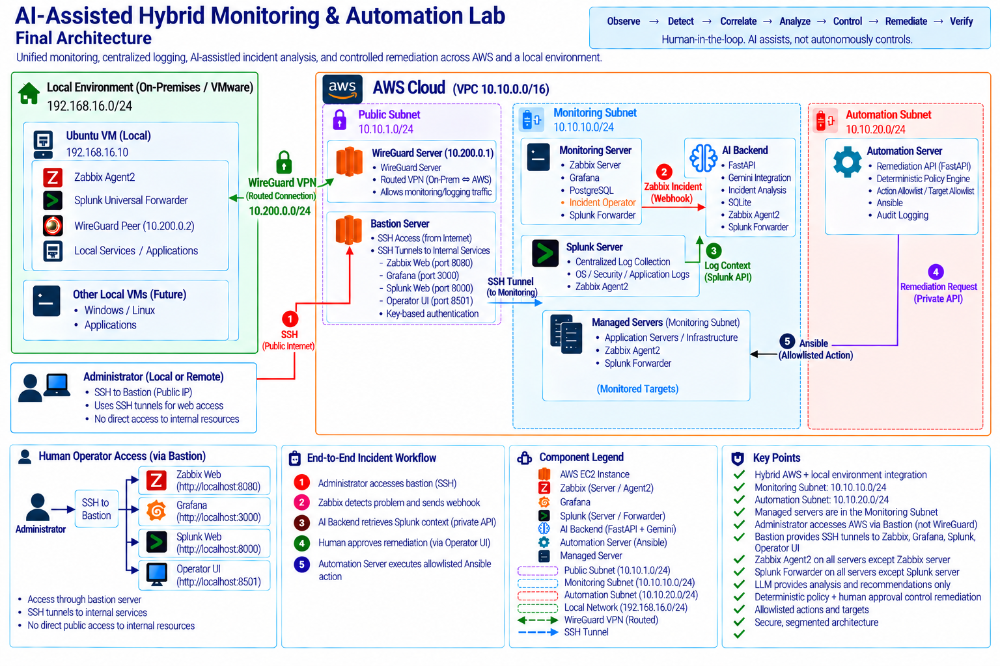
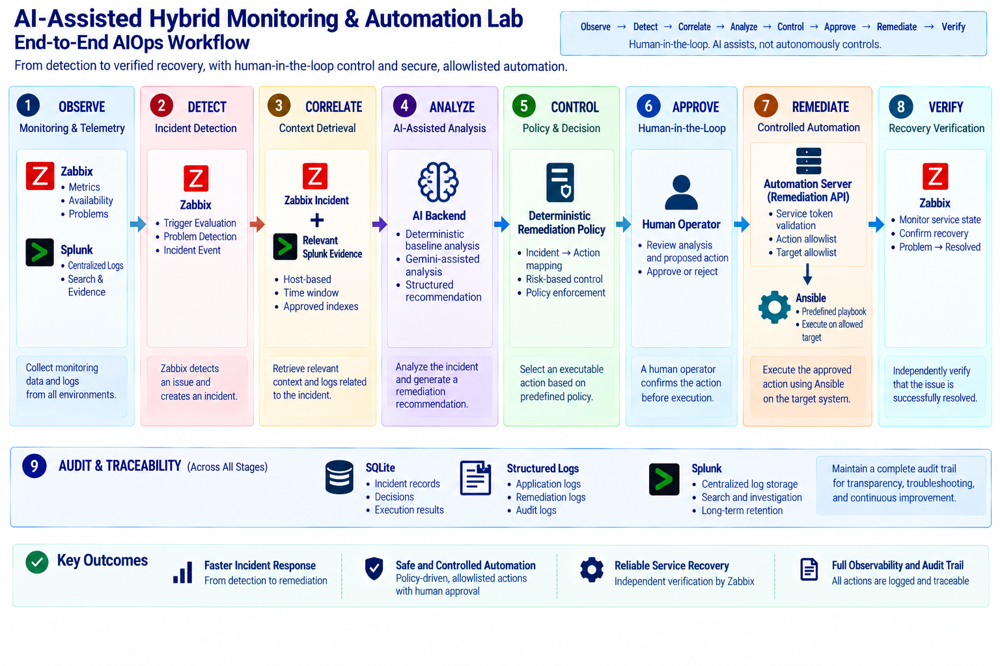
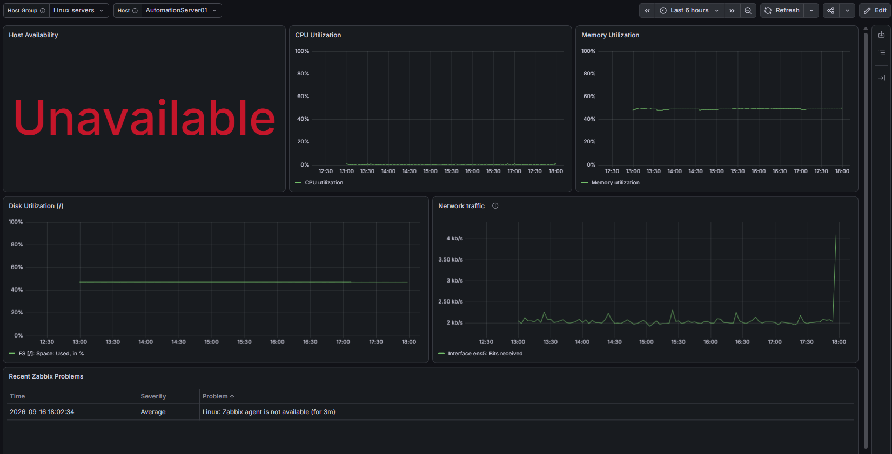
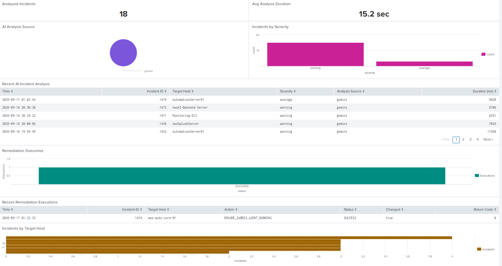
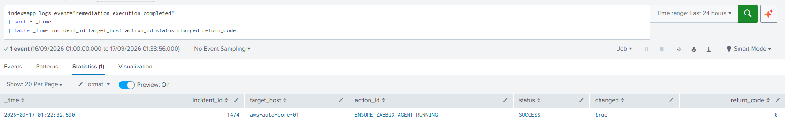
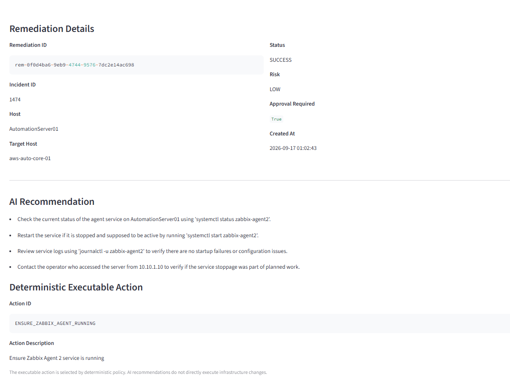
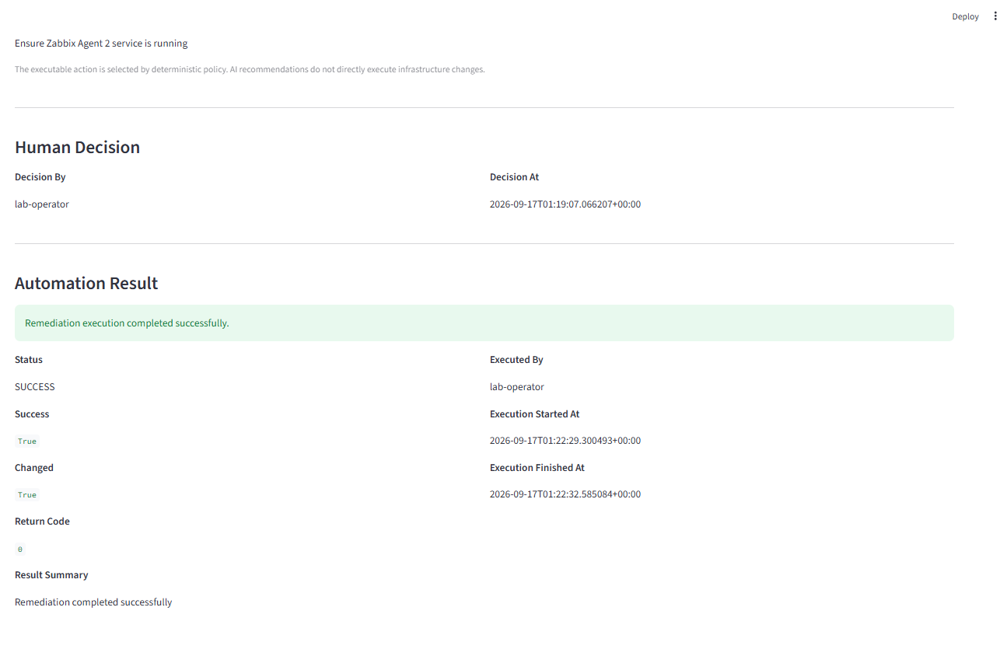
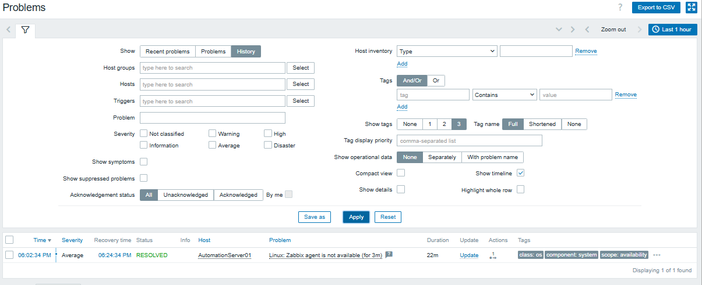

# AI-Assisted Hybrid Monitoring & Automation Lab

A hybrid AWS and local VMware lab that integrates **Zabbix monitoring, Splunk log correlation, AI-assisted incident analysis, human-approved remediation, Ansible automation, and independent recovery verification**.

The project explores a controlled AIOps model in which AI assists operational decision-making without directly controlling infrastructure.

> **LLM recommends → deterministic policy decides → human approves → allowlisted automation executes → monitoring independently verifies recovery**

---

## Architecture



The environment combines an AWS VPC (`10.10.0.0/16`) with a local VMware network (`192.168.16.0/24`) through a WireGuard overlay (`10.200.0.0/24`).

The AWS side separates responsibilities across dedicated systems:

| Component | Primary Role |
| --- | --- |
| Bastion Server | Administrative SSH access and tunnels to internal web services |
| Monitoring Server | Zabbix Server, Grafana, PostgreSQL, Operator Console |
| Splunk Server | Centralized log collection and search |
| AI Backend | FastAPI incident analysis, Splunk correlation, Gemini integration |
| Automation Server | Remediation API, deterministic policy controls, Ansible |
| Managed Server | Monitored and automated workload |
| WireGuard Server | Routed AWS ↔ local hybrid connectivity |

Administrative access enters through the **Bastion Server**. WireGuard is a separate hybrid connectivity path for monitoring and logging traffic between the local environment and AWS.

---

## End-to-End AIOps Workflow



The implemented workflow separates monitoring, analysis, authorization, execution, and verification:

```text
Observe → Detect → Correlate → Analyze → Control → Approve → Remediate → Verify
```

**Zabbix** detects infrastructure problems. The **AI Backend** combines the incident with bounded **Splunk** evidence, a deterministic baseline, and Gemini-assisted analysis. A deterministic remediation policy then determines whether a predefined action is eligible.

The proposed executable action must be approved by a human operator before the private Remediation API validates the action and target and invokes an allowlisted Ansible playbook.

The LLM does **not** directly invoke Ansible or execute generated commands.

Audit information is preserved through SQLite, structured application/remediation logs, and Splunk.

---

## Monitoring & Incident Detection

Zabbix is the primary problem-detection source. Grafana provides infrastructure visualization for availability, CPU, memory, disk, network traffic, and recent Zabbix problems.

The following dashboard captures the controlled Zabbix Agent failure used in the final validation scenario.



The selected host, `AutomationServer01`, is shown as **Unavailable**, while the recent-problems panel records:

```text
Linux: Zabbix agent is not available (for 3m)
```

This provides the monitoring-side starting point for the incident lifecycle.

---

## Splunk Correlation & Operational Evidence

Splunk Enterprise centralizes operating-system, security, application, AI-analysis, and remediation evidence.

Primary indexes include:

```text
linux_os
linux_security
app_logs
```

The AI Backend retrieves incident context through the Splunk Management API using the restricted `ai_context_reader` role. Retrieval is bounded by approved indexes, host identity, time window, result limits, and selected fields.

The Splunk dashboard provides an operational view of AI incident analysis and remediation outcomes:



The dashboard shows analyzed incidents, analysis source, severity, recent incident records, and remediation outcomes.

For Incident `1474`, the structured remediation completion event provides direct audit evidence:



```text
incident_id = 1474
target_host = aws-auto-core-01
action_id = ENSURE_ZABBIX_AGENT_RUNNING
status = SUCCESS
changed = true
return_code = 0
```

---

## AI-Assisted Analysis with Deterministic Control

The AI Backend is implemented with **Python, FastAPI, Pydantic, SQLite, and Gemini**.

Its analysis pipeline combines:

```text
Zabbix Incident
      +
Deterministic Baseline
      +
Relevant Splunk Evidence
      ↓
Structured AI-Assisted Recommendation
```

Observed evidence is kept separate from possible causes, and Splunk correlation is not automatically treated as proof of causation.

The backend also supports graceful degradation: deterministic analysis remains available if Gemini is unavailable, and incident processing can continue without log context if Splunk is unavailable.

Structured AI analysis is written to:

```text
/var/log/ai-backend/analysis.json.log
```

AI recommendations remain advisory. Executable remediation is selected independently by deterministic policy.

---

## Human-in-the-Loop Remediation

The Operator Console makes the control boundary visible.

The incident view distinguishes the **AI Recommendation** from the **Deterministic Executable Action**:



For Incident `1474`, the deterministic policy selected:

```text
ENSURE_ZABBIX_AGENT_RUNNING
```

The interface explicitly communicates that AI recommendations do not directly execute infrastructure changes.

The remediation lifecycle records the human decision and final automation result:



The captured result shows:

```text
Decision By: lab-operator
Executed By: lab-operator
Status: SUCCESS
Changed: True
Return Code: 0
```

The private Remediation API accepts only predefined actions and authorized targets. It validates the service token, action allowlist, target allowlist, and fixed action-to-playbook mapping before invoking Ansible.

Arbitrary commands, arbitrary scripts, user-supplied playbook paths, and unrestricted shell execution are not accepted.

---

## Independent Recovery Verification

A successful automation result does not prove that the monitored service recovered.

Zabbix independently evaluates the target after remediation:



The captured Zabbix history shows the `AutomationServer01` agent problem as **RESOLVED**.

This closes the operational loop:

```text
Detection
   ↓
Analysis & Correlation
   ↓
Human-Approved Remediation
   ↓
Automation Success
   ↓
Independent Monitoring Verification
```

> **Automation success ≠ verified service recovery.**

---

## Security & Reliability Design

The project applies several controls to keep AI assistance separate from infrastructure authority:

- **Human approval** before remediation execution
- **Deterministic incident-to-action policy**
- **Action and target allowlists**
- **Fixed action-to-playbook mappings**
- Private Remediation API with service-token validation
- Least-privilege Splunk API account and index access
- Bastion-based administrative access to internal web services
- WireGuard for routed hybrid monitoring/logging connectivity
- Scoped Ansible Vault loading for Splunk Forwarder credentials
- Restricted SQLite and structured-log permissions
- Structured remediation audit events
- systemd/Docker persistence for operational services
- Git exclusions for secrets, runtime databases, Terraform state, and private inventory

Host-name normalization used for monitoring/log correlation is separate from remediation authorization.

---

## Infrastructure & Automation

Infrastructure and configuration ownership are intentionally separated:

```text
Terraform
└── AWS VPC, subnets, routing, EC2, Security Groups, EIPs

Ansible
└── OS/application configuration, agents, forwarders, remediation
```

Terraform was used to import and reconcile the existing AWS lab infrastructure. The final state contains **65 managed resources** and was validated with a no-change plan.

Ansible provides reusable automation for:

- Zabbix Agent 2 deployment
- Splunk Universal Forwarder deployment
- Debian/Ubuntu and RedHat-family handling
- Service configuration and handlers
- Idempotent remediation
- Scoped Vault usage

---

## Technology Stack

| Area | Technologies |
| --- | --- |
| Cloud & IaC | AWS, Terraform |
| Local Environment | VMware, Ubuntu |
| Hybrid Networking | WireGuard, SSH/Bastion |
| Monitoring | Zabbix Server, Zabbix Agent 2 |
| Dashboards | Grafana |
| Centralized Logging | Splunk Enterprise, Universal Forwarder |
| AI Backend | Python, FastAPI, Pydantic, SQLite |
| AI Assistance | Gemini |
| Automation | Ansible |
| Operator Interface | Streamlit |
| Runtime | Docker, Docker Compose, systemd |
| Version Control | Git, GitHub |

---

## Repository Structure

```text
ai-hybrid-monitoring-lab/
├── ai-backend/              # Incident analysis and correlation
├── automation/              # Remediation API and Ansible automation
├── architecture/            # Architecture assets
├── docs/                    # Detailed implementation documentation
├── evidence/                # Selected final validation evidence
├── monitoring/              # Zabbix / Grafana monitoring stack
├── operator-console/        # Human-in-the-loop Streamlit UI
├── terraform/               # AWS infrastructure as code
├── .gitignore
└── README.md
```

Detailed implementation notes, troubleshooting, validation, and security decisions are organized by implementation phase:

**[Browse the Implementation Documentation](docs/README.md)**

---

## Implementation Phases

| Phase | Topic |
| --- | --- |
| 01 | Project Foundation |
| 02 | Automated Zabbix Agent Deployment |
| 03 | Splunk Integration |
| 04 | AI-Assisted Incident Analysis |
| 05 | Splunk Context Retrieval & Correlation |
| 06 | Controlled Automated Remediation |
| 07 | WireGuard Hybrid Connectivity |
| 08 | Terraform Infrastructure as Code |
| 09 | Dashboard & Observability |
| 10 | End-to-End Failure & Recovery Validation |
| 11 | Operator Console |
| 12 | Agent & Forwarder Automation |
| 13 | Security & Reliability Review |

See [`docs/README.md`](docs/README.md) for the complete documentation index.

---

## Accepted Lab Limitations

This lab documents remaining limitations rather than presenting them as production-complete controls:

- **Splunk API TLS:** the current private Splunk Management API connection uses the default certificate with certificate verification disabled. Access is restricted by Security Group and a least-privilege Splunk account. A production deployment should use a trusted certificate/CA.
- **Splunk Forwarder package integrity:** RedHat-family installation uses an official HTTPS source and pinned build, but independent checksum/signature verification is not yet implemented.
- **RedHat fresh-install path:** the current role detects the existing forwarder correctly, but a complete fresh installation should also be validated on a disposable RedHat-family host.
- **Public IPv4 trade-off:** Bastion and WireGuard require public connectivity, while some earlier lab workloads retain public IPv4 addresses because the lab avoids a NAT Gateway for cost reasons.

---

## Key Outcomes

The completed lab demonstrates that an AI-assisted operations workflow can remain controlled and auditable when responsibilities are clearly separated:

**Monitoring detects. Splunk provides evidence. AI assists analysis. Deterministic policy controls executable actions. A human authorizes remediation. Ansible performs the predefined change. Zabbix independently verifies recovery.**

This separation is the central design principle of the project.
