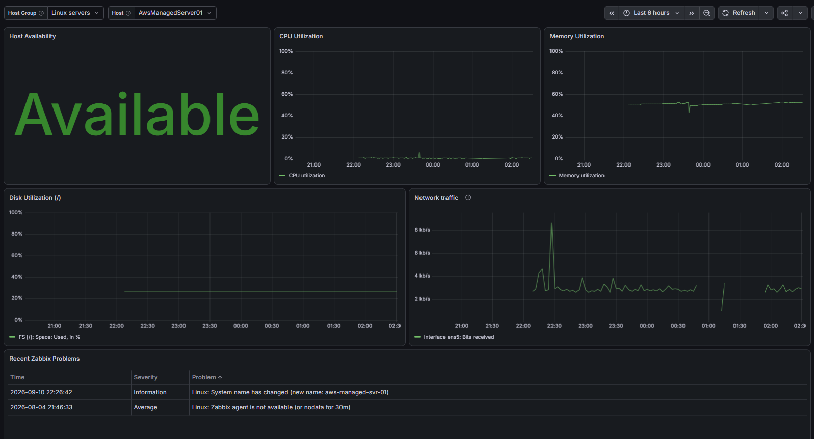
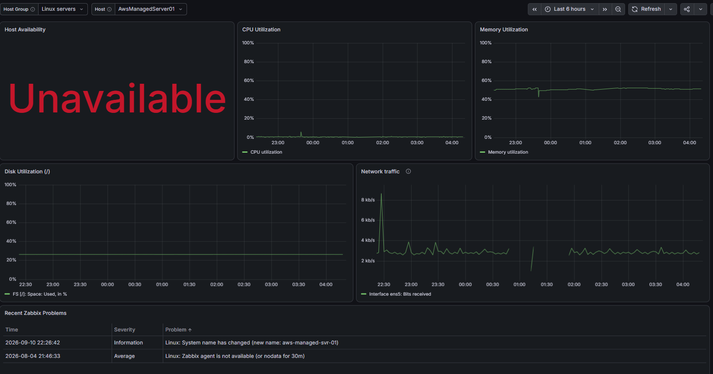
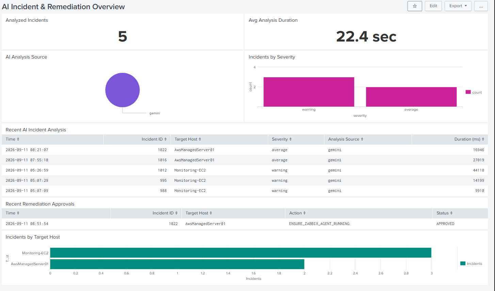
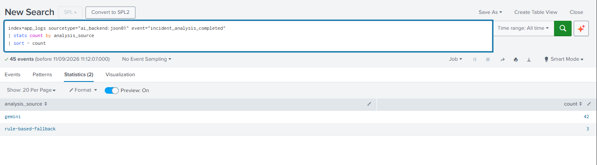

# Dashboard & Observability


Dashboard and observability refinement focused on improving the **operational visibility** of the existing monitoring and automation environment.

Rather than adding another monitoring platform, the work refined the
existing **Grafana** and **Splunk** dashboards so that infrastructure
health, AI-assisted incident analysis, fallback behavior, and the full
remediation execution outcome can be understood from a concise set of
operational views.

------------------------------------------------------------------------

## 1. Objectives

The goals for dashboard and observability refinement were to:

-   Improve the existing Grafana infrastructure overview.
-   Reuse host filtering so the same dashboard can inspect different
    monitored systems.
-   Surface Zabbix availability and active problems alongside
    performance metrics.
-   Build a concise Splunk dashboard for AI incident-analysis telemetry.
-   Visualize incident severity, analysis source, target host, and
    analysis duration.
-   Extend remediation observability from approval to execution outcome.
-   Surface both successful and failed remediation attempts using
    structured telemetry.
-   Keep Grafana and Splunk focused on complementary observability roles
    rather than duplicating the same information.

------------------------------------------------------------------------

## 2. Observability Strategy

The dashboard responsibilities were intentionally separated.

### Grafana

Grafana provides the **infrastructure and monitoring-state view**:

-   Host availability
-   CPU utilization
-   Memory utilization
-   Root filesystem utilization
-   Network traffic
-   Recent Zabbix problems

### Splunk

Splunk provides the **incident, AI-analysis, and remediation evidence
view**:

-   Number of analyzed incidents
-   Average AI analysis duration
-   Gemini vs deterministic fallback analysis source
-   Incident severity distribution
-   Recent AI incident analyses
-   Remediation execution outcomes
-   Recent remediation executions
-   Incidents grouped by target host

This separation keeps the dashboards concise while showing the
monitoring-to-analysis-to-remediation workflow.

------------------------------------------------------------------------

## 3. Grafana Dashboard Improvements

The existing Zabbix-backed Grafana dashboard was polished into a
reusable infrastructure overview.

The existing `$Host` variable is used to switch between monitored
systems without maintaining separate dashboards for each host.

Key panels include:

  -----------------------------------------------------------------------
  Panel                               Purpose
  ----------------------------------- -----------------------------------
  Host Availability                   Shows whether the Zabbix agent is
                                      currently available

  CPU Utilization                     Displays CPU usage for the selected
                                      host

  Memory Utilization                  Displays memory usage for the
                                      selected host

  Disk Utilization (/)                Displays used space on the root
                                      filesystem

  Network Traffic                     Displays network activity for the
                                      selected host

  Recent Zabbix Problems              Displays recent problems associated
                                      with the selected host
  -----------------------------------------------------------------------

### Healthy Hybrid Host View

A local VMware VM monitored through the hybrid environment demonstrates
that the AWS-hosted monitoring stack can observe infrastructure outside
AWS.


### Failure Detection View

A powered-off monitored host demonstrates the relationship between
availability, metric interruption, and Zabbix problem detection.


------------------------------------------------------------------------

## 4. Zabbix Problems Table Processing

The Grafana Zabbix Problems query returned structured problem data that
required additional transformation before it was suitable for an
operational dashboard.

The final table was simplified to the most useful fields:

-   Time
-   Severity
-   Problem

Severity values were mapped to readable Zabbix severity labels, and the
Unix timestamp was converted into a human-readable date/time value.

This produced a compact problem table that can be correlated visually
with host availability and performance metrics.

------------------------------------------------------------------------

## 5. Splunk AI Incident & Remediation Overview

A Splunk dashboard named:

**AI Incident & Remediation Overview**

was created from the structured application telemetry collected in
`index=app_logs`.

The final dashboard includes:

  -----------------------------------------------------------------------
  Panel                               Purpose
  ----------------------------------- -----------------------------------
  Analyzed Incidents                  Total number of completed incident
                                      analyses in the selected time range

  Avg Analysis Duration               Average AI analysis processing time
                                      in seconds

  AI Analysis Source                  Distribution of Gemini and
                                      rule-based fallback analysis

  Incidents by Severity               Distribution of analyzed incidents
                                      by severity

  Recent AI Incident Analysis         Recent incident IDs, target hosts,
                                      severity, analysis source, and
                                      duration

  Remediation Outcomes                Distribution of completed
                                      remediation executions by `SUCCESS`
                                      / `FAILED` status

  Recent Remediation Executions       Recent target hosts, actions,
                                      status, change state, and return
                                      codes

  Incidents by Target Host            Distribution of analyzed incidents
                                      across monitored target systems
  -----------------------------------------------------------------------

Summary panels use a compact two-column layout, while operational tables
and host-level views use the full dashboard width.


------------------------------------------------------------------------

## 6. Resolving the Splunk `host` Field Collision

During dashboard development, incident counts grouped directly by `host`
produced incorrect totals.

The application JSON payload contains the **incident target host**,
while Splunk also maintains its own `host` metadata for the system
forwarding the log. This can result in multiple values being associated
with the same field.

The application-level target was therefore explicitly extracted from the
raw JSON:

``` spl
| spath input=_raw path=host output=target_host
```

Dashboard searches use `target_host` when referring to the monitored
system associated with an incident.

Example:

``` spl
index=app_logs sourcetype="ai_backend:json01" event="incident_analysis_completed"
| spath input=_raw path=host output=target_host
| stats count AS Incidents by target_host
| sort - Incidents
| rename target_host AS "Target Host"
```

This prevents Splunk forwarding metadata from being confused with the
application-level incident target.

------------------------------------------------------------------------

## 7. AI Analysis Source and Fallback Visibility

The AI backend records the source used to produce each incident
analysis.

Observed analysis sources include:

-   `gemini`
-   `rule-based-fallback`

This makes it possible to verify both normal Gemini-assisted analysis
and the deterministic fallback path.

``` spl
index=app_logs sourcetype="ai_backend:json01" event="incident_analysis_completed"
| stats count by analysis_source
| sort - count
```

A wider time range can be used to verify both analysis paths.


------------------------------------------------------------------------

## 8. Recent AI Incident Analysis

The recent incident table provides a compact investigation view
containing:

-   Timestamp
-   Incident ID
-   Target Host
-   Severity
-   Analysis Source
-   Analysis Duration

Example search:

``` spl
index=app_logs sourcetype="ai_backend:json01" event="incident_analysis_completed"
| spath input=_raw path=host output=target_host
| sort - _time
| eval Time=strftime(_time, "%Y-%m-%d %H:%M:%S")
| table Time incident_id target_host severity analysis_source duration_ms
| rename incident_id AS "Incident ID",
         target_host AS "Target Host",
         severity AS "Severity",
         analysis_source AS "Analysis Source",
         duration_ms AS "Duration (ms)"
```

The average analysis duration is converted from milliseconds to seconds
for the dashboard KPI, producing a readable value such as `22.4 sec`.

------------------------------------------------------------------------

## 9. Remediation Lifecycle Observability

Structured logs now expose multiple stages of the remediation workflow:

``` text
remediation_approved
        ↓
remediation_execution
        ↓
remediation_execution_completed
        ↓
SUCCESS / FAILED
```

The events are generated across the application components:

-   `remediation_approved` --- AI backend
-   `remediation_execution` --- Remediation API / automation server
-   `remediation_execution_completed` --- AI backend after the execution
    result is returned and persisted

This allows Splunk to provide evidence across the approval and execution
path rather than stopping at operator approval.

An HTTP `200` response indicates that the remediation request and
response flow completed successfully at the API level. The actual
automation result is represented separately by the structured
remediation `status`.

------------------------------------------------------------------------

## 10. Remediation Outcomes

Completed remediation executions use a common event:

``` text
event = remediation_execution_completed
```

The execution result is represented by fields such as:

-   `remediation_id`
-   `incident_id`
-   `target_host`
-   `action_id`
-   `status`
-   `success`
-   `changed`
-   `return_code`

The same event therefore represents both successful and failed execution
outcomes:

``` text
status=SUCCESS  success=true   return_code=0
status=FAILED   success=false  return_code!=0
```

This is preferable to inferring execution success from HTTP status or
from separate event names.

A dashboard panel can summarize actual remediation outcomes with:

``` spl
index=app_logs event="remediation_execution_completed"
| stats count AS Executions by status
| sort - Executions
```

This enables the **Remediation Outcomes** visualization to display
`SUCCESS` and `FAILED` executions directly from structured telemetry.

------------------------------------------------------------------------

## 11. Recent Remediation Executions

The earlier dashboard view focused on `remediation_approved` events.
After validating execution-result telemetry, the operational view was
extended to show the final execution result.

Example search:

``` spl
index=app_logs event="remediation_execution_completed"
| sort - _time
| eval Time=strftime(_time, "%Y-%m-%d %H:%M:%S")
| table Time incident_id target_host action_id status changed return_code
| rename incident_id AS "Incident ID",
         target_host AS "Target Host",
         action_id AS "Action",
         status AS "Status",
         changed AS "Changed",
         return_code AS "Return Code"
```

The resulting table provides direct evidence of whether an automation
action succeeded or failed and whether the target state was changed.

During validation, both outcomes were observed in Splunk, including
failed executions with a non-zero return code. This confirms that the
dashboard represents real execution telemetry rather than only
successful remediation paths.

------------------------------------------------------------------------

## 12. Dashboard Design Decisions

Several design decisions were made to keep the dashboards useful as
operational tools:

-   Reused a host selector instead of creating per-host Grafana
    dashboards.
-   Kept Grafana focused on infrastructure health and Zabbix monitoring
    state.
-   Kept Splunk focused on incident analysis, AI telemetry, and
    remediation evidence.
-   Used real extracted fields rather than creating dashboard fields
    that were not present in the logs.
-   Resolved the Splunk metadata/application `host` collision before
    building host-level visualizations.
-   Converted timestamps and durations into human-readable formats.
-   Used a compact two-column layout for high-level Splunk panels.
-   Avoided adding panels solely to fill unused dashboard space.
-   Distinguished API request success from the actual remediation
    execution outcome.
-   Used `remediation_execution_completed.status` as the authoritative
    dashboard field for `SUCCESS` / `FAILED` execution results.
-   Included failed executions as operational evidence instead of
    presenting only successful automation runs.

------------------------------------------------------------------------

## 13. Validation Evidence

The following screenshots capture the final Grafana and Splunk views used to
validate the observability layer.

### Grafana — Healthy Hybrid Host



### Grafana — Failure Detection



### Splunk — AI Incident & Remediation Overview



### Splunk — Gemini vs Rule-Based Fallback



------------------------------------------------------------------------

## 14. Outcome

Dashboard and observability refinement transformed the existing monitoring and automation telemetry into
a concise operational observability layer.

Grafana provides a reusable host-centric view connecting:

> **Availability → Infrastructure Metrics → Zabbix Problems**

Splunk provides a complementary incident and automation view connecting:

> **Incident Analysis → AI/Fallback Source → Severity → Target Host →
> Remediation Approval → Automation Execution → SUCCESS / FAILED**

The completed dashboard layer demonstrates an important design principle
of the lab:

> **Monitoring detects, AI assists analysis, deterministic policy
> controls remediation, humans approve, automation executes, and
> structured telemetry records the outcome.**

The result is not only a visual dashboard improvement, but also an
auditable view of the end-to-end remediation lifecycle across the AI
backend and automation service.
