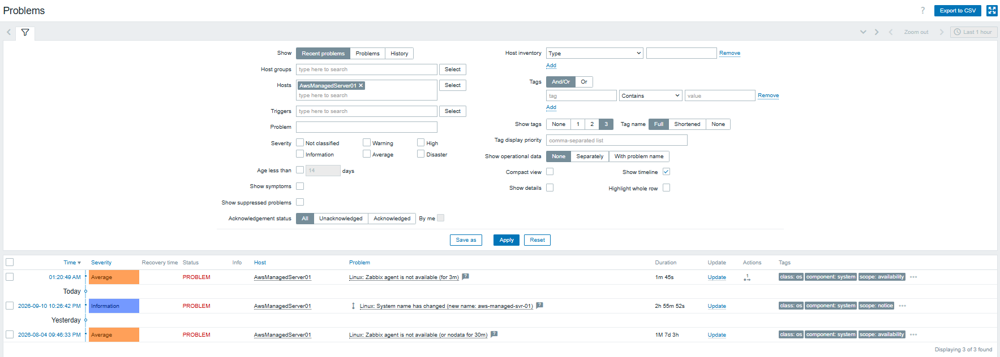
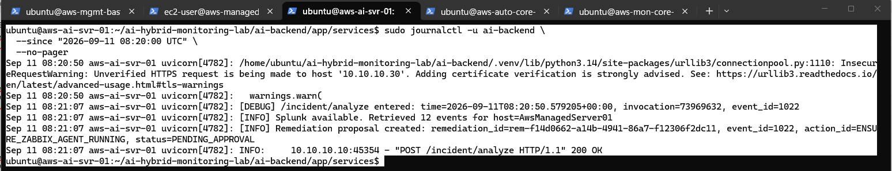
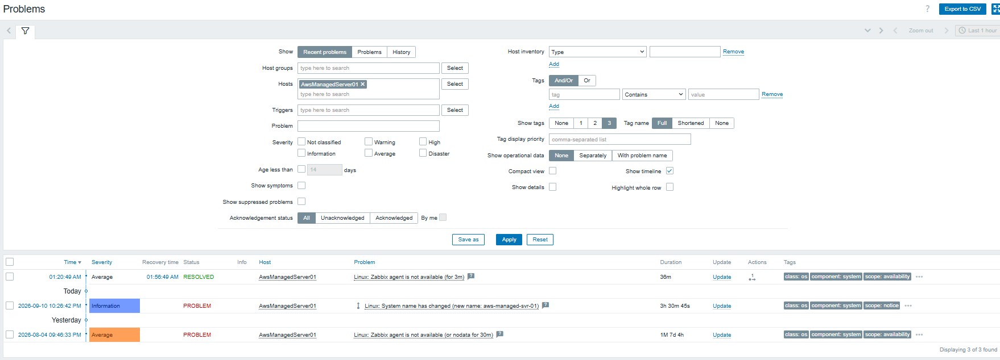

# End-to-End Failure & Recovery Validation


end-to-end failure and recovery validation validates the complete incident-response workflow built
throughout the lab by introducing a controlled Zabbix Agent 2 failure on
a managed AWS server and following the incident through detection,
evidence collection, AI-assisted analysis, human approval, automated
remediation, and independent recovery verification.

The goal of this exercise was not to add new functionality, but to prove
that the existing monitoring and automation components work together as
a controlled end-to-end system.

------------------------------------------------------------------------

## 1. Validation Objective

The test validates the following operational workflow:

``` text
Healthy Baseline
      ↓
Controlled Failure Injection
      ↓
Zabbix Detection
      ↓
Webhook → AI Backend
      ↓
Splunk Context Retrieval
      ↓
Gemini-Assisted Analysis
      ↓
Deterministic Remediation Policy
      ↓
Human Approval
      ↓
Automation API
      ↓
Ansible Remediation
      ↓
Target Host Recovery
      ↓
Zabbix Independent Recovery Verification
```

A key design principle is that the LLM provides analysis and
recommendations but does **not** directly execute infrastructure
changes. Executable remediation is selected by deterministic policy and
requires explicit operator approval.

------------------------------------------------------------------------

## 2. Test Target

  Component               Value
  ----------------------- -------------------------------
  Managed host            `aws-managed-svr-01`
  Zabbix display name     `AwsManagedServer01`
  Controlled service      `zabbix-agent2`
  Remediation action      `ENSURE_ZABBIX_AGENT_RUNNING`
  Remediation risk        `LOW`
  Approval required       `true`
  Operator                `lab-operator`
  Final Zabbix event ID   `1022`

Before failure injection, the target was confirmed healthy and the
Zabbix Agent 2 service was enabled and running.

------------------------------------------------------------------------

## 3. Controlled Failure Injection

The failure was intentionally introduced on the managed server:

``` bash
date -u '+%Y-%m-%dT%H:%M:%SZ'
sudo systemctl stop zabbix-agent2
sudo systemctl status zabbix-agent2 --no-pager
```

Final test run:

``` text
Failure injection timestamp: 2026-09-11 08:17:11 UTC
Service state: inactive (dead)
```

This provided a repeatable service-level failure without introducing
unrelated infrastructure changes.

------------------------------------------------------------------------

## 4. Zabbix Detection

Zabbix detected the unavailable agent using the configured availability
trigger:

``` text
Linux: Zabbix agent is not available (for 3m)
```

The problem was raised at approximately:

``` text
2026-09-11 08:20:49 UTC
Severity: Average
```

The configured Zabbix action then invoked the AI Backend
incident-analysis endpoint through the existing webhook workflow.

------------------------------------------------------------------------

## 5. AI Backend and Splunk Context Retrieval

The AI Backend received Zabbix event `1022` and retrieved operational
context from Splunk.

Application log:

``` text
/incident/analyze entered
event_id=1022

Splunk available.
Retrieved 12 events for host=AwsManagedServer01
```

This confirmed all of the following:

-   the Zabbix webhook reached the AI Backend;
-   Splunk was reachable;
-   host identity normalization resolved the Zabbix-visible name to the
    canonical managed-server identity;
-   relevant operational context was available for analysis.

The final incident analysis completed using Gemini:

``` text
event = incident_analysis_completed
incident_id = 1022
analysis_source = gemini
duration_ms = 16946
```

Gemini remained advisory; it did not select or execute an infrastructure
command.

------------------------------------------------------------------------

## 6. Deterministic Remediation Proposal

After analysis, the deterministic remediation policy matched the
incident to the allowlisted action:

``` text
ENSURE_ZABBIX_AGENT_RUNNING
```

A remediation proposal was created:

``` text
status = PENDING_APPROVAL
target_host = aws-managed-svr-01
risk = LOW
approval_required = true
```

At this stage, execution-related fields remained unset. This
demonstrated that creating an AI-assisted remediation proposal did not
automatically change the managed infrastructure.

------------------------------------------------------------------------

## 7. Human-in-the-Loop Approval

The operator explicitly approved the remediation through the protected
remediation endpoint.

Result:

``` text
status = APPROVED
decision_by = lab-operator
decision_at = 2026-09-11T08:51:54.338992+00:00
execution_started_at = null
success = null
```

The separation between `APPROVED` and execution demonstrates a
deliberate human control boundary.

Operator authentication was protected using HTTP Basic authentication
with credentials stored outside the application source code.

------------------------------------------------------------------------

## 8. Automated Remediation Execution

After approval, the remediation execution endpoint was invoked.

The workflow transitioned through the Automation API and Ansible to the
managed host.

Final result:

``` text
status = SUCCESS
target_host = aws-managed-svr-01
action_id = ENSURE_ZABBIX_AGENT_RUNNING
success = true
changed = true
return_code = 0
executed_by = lab-operator
result_summary = Remediation executed successfully
```

Execution timing:

``` text
Started:  2026-09-11 08:54:22 UTC
Finished: 2026-09-11 08:54:25 UTC
```

The automation therefore completed in approximately three seconds.

The action was constrained to the predefined remediation operation
rather than arbitrary shell execution.

------------------------------------------------------------------------

## 9. Recovery Validation at Three Layers

Recovery was validated independently at three layers.

### Automation Layer

The remediation record reported:

``` text
status = SUCCESS
success = true
changed = true
return_code = 0
```

### Managed Host OS Layer

The target server independently showed:

``` text
zabbix-agent2.service
Active: active (running)
```

The system log showed the service starting at approximately
`08:54:24 UTC` and reaching the running state at `08:54:25 UTC`.

### Monitoring Layer

Zabbix independently detected that monitoring connectivity had
recovered:

``` text
Status: RESOLVED
Recovery time: 2026-09-11 08:56:49 UTC
```

The monitoring system therefore confirmed recovery approximately 2
minutes 24 seconds after automation execution completed.

This separation is important: an automation success response alone was
not treated as proof of full service recovery.

------------------------------------------------------------------------

## 10. Splunk Evidence and Audit Trail

Splunk provided two complementary forms of evidence during the test.

### Target-Host Operational Evidence

Logs from `aws-managed-svr-01` captured the controlled failure and
subsequent automation activity.

Examples included:

``` text
systemctl stop zabbix-agent2
BECOME-SUCCESS
systemctl status zabbix-agent2
```

Relevant data was collected from the existing `linux_security` and
`linux_os` indexes.

### AI Backend Structured Audit Logs

The AI Backend writes structured JSON logs to:

``` text
/var/log/ai-backend/analysis.json.log
```

Splunk Universal Forwarder monitors this file using:

``` text
index = app_logs
sourcetype = ai_backend:json01
```

For event `1022`, Splunk captured:

``` text
incident_analysis_completed
analysis_source = gemini
```

and:

``` text
remediation_approved
action_id = ENSURE_ZABBIX_AGENT_RUNNING
status = APPROVED
actor = lab-operator
```

The final remediation execution result was validated from the
Remediation API record and was later strengthened with dedicated
structured execution logging on the Automation Server.

The Automation API writes execution audit events to:

``` text
/var/log/remediation-api/execution.json.log
```

The Automation API execution log records operationally useful fields
such as:

``` text
event = remediation_execution
remediation_id
incident_id
action_id
target
status
success
changed
return_code
message
```

The normalized `message` field is shared with the API response so that
operators can understand the outcome without exposing unnecessary
implementation details or raw command output. Raw `stdout` and `stderr`
remain internal diagnostic data and are not added to this structured
execution record.

The later observability hardening also added the AI Backend lifecycle
completion event:

``` text
event = remediation_execution_completed
```

This event records the final remediation outcome, including both
`SUCCESS` and `FAILED` executions, and complements the Automation API
execution log rather than replacing it.

------------------------------------------------------------------------

## 11. Final Test Timeline

  -----------------------------------------------------------------------
  UTC Time                            Event
  ----------------------------------- -----------------------------------
  08:17:02                            Test timestamp recorded

  08:17:11                            `zabbix-agent2` manually stopped

  08:20:49                            Zabbix raised the agent-unavailable
                                      problem

  08:20:50                            AI Backend received event `1022`

  08:21:07                            Splunk context retrieved; analysis
                                      completed; remediation proposal
                                      created

  08:21:07                            Proposal entered `PENDING_APPROVAL`

  08:51:54                            Operator approved remediation

  08:54:22                            Remediation execution started

  08:54:25                            Automation completed with `SUCCESS`

  08:54:25                            Managed host showed Zabbix Agent 2
                                      running

  08:56:49                            Zabbix independently marked the
                                      problem `RESOLVED`
  -----------------------------------------------------------------------

The relatively long interval between proposal creation and execution
represents the deliberate human-in-the-loop decision period rather than
automation latency.

------------------------------------------------------------------------

## 12. Expected vs. Actual Results

  -------------------------------------------------------------------------------------------------
  Validation Point  Expected                      Actual                          Result
  ----------------- ----------------------------- ------------------------------- -----------------
  Controlled        Agent becomes unavailable     Agent became `inactive (dead)`  PASS
  service failure                                                                 

  Zabbix detection  Problem generated             Agent unavailable problem       PASS
                                                  generated                       

  Webhook delivery  AI Backend receives incident  Event `1022` received           PASS

  Splunk            Context service reachable     Splunk available                PASS
  availability                                                                    

  Context retrieval Relevant evidence returned    12 events retrieved             PASS

  AI analysis       Advisory analysis completes   Gemini analysis completed       PASS

  Policy evaluation Allowlisted action selected   `ENSURE_ZABBIX_AGENT_RUNNING`   PASS

  Approval control  Proposal waits for operator   `PENDING_APPROVAL` observed     PASS

  Human approval    Operator explicitly approves  `lab-operator` → `APPROVED`     PASS

  Automation        Approved action executes      `SUCCESS`, RC `0`               PASS
  execution                                                                       

  Target state      Agent returns to running      `active (running)`              PASS

  Independent       Zabbix detects recovery       Problem `RESOLVED`              PASS
  monitoring                                                                      
  recovery                                                                        

  Splunk            Failure/remediation activity  Relevant host activity          PASS
  operational       visible                       collected                       
  evidence                                                                        

  Structured audit  Analysis/approval/execution   Structured lifecycle evidence   PASS
  logging           events recorded               available                       
  -------------------------------------------------------------------------------------------------

------------------------------------------------------------------------

## 13. Issue Discovered During Validation

The initial validation attempt exposed an identity-normalization issue.

The environment used two legitimate identifiers for the same server:

``` text
Zabbix display name:  AwsManagedServer01
Canonical hostname:   aws-managed-svr-01
```

The Zabbix webhook supplied `{HOST.NAME}`, which corresponded to the
display name. Splunk and automation resources used the canonical
hostname.

The host identity mapping was corrected so that:

``` text
AwsManagedServer01 → aws-managed-svr-01
```

After the correction, the controlled test was reset and repeated from
the beginning.

The final run retrieved:

``` text
Splunk available. Retrieved 12 events
```

instead of the zero-event result observed during the earlier attempt.

A separate pre-flight cleanup also standardized the canonical
managed-host name across the Ansible inventory, remediation allowlist,
Zabbix Agent configuration, and related project configuration. Splunk
Universal Forwarder was restarted after the hostname change so its
startup-decided host metadata reflected the canonical hostname.

This validation demonstrated why consistent host identity is critical
when correlating monitoring, logging, and automation systems.

------------------------------------------------------------------------

## 14. Security and Control Boundaries

The end-to-end test preserved the project's security model:

-   Gemini provided advisory analysis rather than direct infrastructure
    control.
-   Remediation selection was performed by deterministic policy.
-   Only predefined remediation actions were eligible for execution.
-   The managed target was resolved to an approved canonical host.
-   Human approval was required before execution.
-   Approval and execution were separate API operations.
-   Operator identity was recorded for the decision and execution.
-   Credentials and service configuration were stored outside source
    code.
-   Existing private-network and security-group boundaries were
    preserved during testing.
-   No additional Bastion-to-AI-Backend access rule was introduced
    merely to expose Swagger.
-   Automation results were independently validated by both the target
    OS and Zabbix.

------------------------------------------------------------------------

## 15. Validation Evidence

The following screenshots document the key stages of the final
end-to-end validation run.

### 15.1 Zabbix Failure Detection



Zabbix detected the controlled Zabbix Agent 2 failure on
`AwsManagedServer01` and generated an Average-severity availability
problem.

### 15.2 Splunk Target-Host Operational Evidence


Splunk captured target-side activity associated with the validation
scenario, including the controlled `systemctl stop zabbix-agent2`
command, Ansible privilege-escalation activity, and post-remediation
service verification.

### 15.3 AI Analysis and Approval Audit Trail



Structured AI Backend events collected in Splunk correlate incident
`1022` with the Gemini-assisted analysis and the explicit operator
approval of the allowlisted remediation action.

### 15.4 Automated Remediation Result


The remediation API record confirms successful execution against
`aws-managed-svr-01` with `success=true`, `changed=true`, and
`return_code=0`.

### 15.5 Managed Host Service Recovery


OS-level verification on the managed server confirms that
`zabbix-agent2` returned to the `active (running)` state after automated
remediation.

### 15.6 Zabbix Independent Recovery Verification



Zabbix independently detected restored agent availability and changed
the incident state to `RESOLVED`, providing monitoring-layer
confirmation beyond the automation result.

### 15.7 Grafana Recovered Monitoring State


The Grafana dashboard shows `AwsManagedServer01` in an `Available` state
with host metrics visible after recovery.

## 16. Post-Validation Reliability Hardening

After the primary end-to-end failure and recovery validation validation was completed, the remediation
workflow was tested against an additional approved host,
`aws-vpn-gw-01`. This extension exposed an important edge case in the
automation execution boundary.

### 16.1 False-Success Condition Discovered

The remediation playbook is intentionally scoped to:

``` yaml
hosts: remediation_targets
```

The VPN Gateway existed in the general Ansible inventory and in other
functional groups, but it was initially absent from:

``` ini
[remediation_targets]
```

When execution was attempted with:

``` bash
ansible-playbook \
  playbooks/ensure_zabbix_agent_running.yml \
  --limit aws-vpn-gw-01
```

Ansible reported:

``` text
skipping: no hosts matched
```

However, the process still returned exit code `0`. The original executor
treated `return_code == 0` as sufficient evidence of success, producing
a false-positive remediation result even though no task had executed.

### 16.2 Defensive Success Evaluation

The Automation API executor was hardened so that success requires both:

``` text
process return code == 0
AND
target execution scope is not empty
```

The executor now detects the `no hosts matched` condition and converts
it into an application-level failure.

Importantly, `changed=false` is **not** treated as a failure. An
idempotent remediation may legitimately complete successfully without
changing the target when the desired state is already present.

This distinction prevents false positives while preserving normal
Ansible idempotency.

### 16.3 Operator-Friendly Result Messages

Execution results were also normalized so that the Operator Console and
API do not need to expose internal implementation terminology.

Example failure:

``` text
Target 'aws-vpn-gw-01' is not included in the remediation execution scope
```

Example success:

``` text
Remediation completed successfully
```

The executor now returns a consistent result contract across normal
execution, missing-action, and timeout paths:

``` text
success
changed
return_code
message
stdout
stderr
```

The user-facing `message` is propagated through the Automation API,
while `stdout` and `stderr` remain available for internal
troubleshooting.

### 16.4 Execution Audit Logging

The Automation API structured execution logger was extended with the
normalized `message` field.

A failed execution can therefore be represented as:

``` json
{
  "event": "remediation_execution",
  "target": "aws-vpn-gw-01",
  "status": "FAILED",
  "success": false,
  "changed": false,
  "return_code": 0,
  "message": "Target 'aws-vpn-gw-01' is not included in the remediation execution scope"
}
```

This is particularly useful for cases where the underlying process exits
normally but application-level validation determines that remediation
did not actually execute.

### 16.5 New Remediation Target Onboarding

The extended-host test clarified that adding a server as an approved
remediation target requires two independent configuration layers.

**Automation API authorization**

``` text
automation/remediation_api/app/config/targets.py
```

The canonical hostname must be present in `ALLOWED_TARGETS`. This
determines whether the API is authorized to execute remediation against
the server.

**Ansible execution scope**

``` text
automation/inventory/hosts.ini
```

The same canonical hostname must be included in:

``` ini
[remediation_targets]
```

This determines whether the remediation playbook can actually select the
host.

Both controls must be satisfied:

``` text
API Target Allowlist
        +
Ansible remediation_targets
        ↓
Approved Execution Target
```

If the Zabbix display name differs from the canonical hostname, the AI
Backend identity mapping must also contain the appropriate normalization
entry, for example:

``` text
AwsVPNGateway → aws-vpn-gw-01
```

This mapping is an identity-normalization layer, not an
execution-authorization mechanism.

The separation between identity mapping, API authorization, and Ansible
execution scope is intentional and provides defense in depth. The new
executor validation also ensures that configuration drift between these
layers fails safely instead of being reported as a successful
remediation.

------------------------------------------------------------------------

## 17. Updated Lessons Learned

The final validation and subsequent reliability testing highlighted
several practical lessons.

**Cross-system identity consistency matters.**\
Monitoring display names, OS hostnames, Splunk host fields, and
automation inventory names may represent the same machine differently. A
normalization layer is necessary when correlating data across systems.

**A zero process return code is not sufficient proof of remediation.**\
Execution tooling may exit successfully even when no target was
selected. Application-level validation is required to prevent
false-positive remediation results.

**Idempotency must remain distinct from failure detection.**\
`changed=false` can represent a valid successful run and should not
automatically be classified as failure.

**Authorization and execution scope should remain separate.**\
The API allowlist controls whether remediation is permitted, while the
Ansible inventory group controls where the remediation playbook can
execute. Requiring both provides an additional safety boundary.

**Automation success is not the same as service recovery.**\
A successful execution result should still be followed by target-state
and monitoring-layer verification.

**Audit logs should explain outcomes without leaking unnecessary
internals.**\
Normalized status and message fields provide useful operational
evidence, while raw execution output remains available only for
troubleshooting.

**Human approval creates a meaningful control boundary.**\
The system can analyze an incident and prepare a safe remediation
without automatically changing infrastructure.

------------------------------------------------------------------------

## 18. Final Result

**end-to-end failure and recovery validation End-to-End Failure Scenario: PASS**

The original end-to-end failure and recovery validation validation successfully demonstrated a controlled
incident lifecycle from failure detection through independently verified
recovery:

``` text
Observe
  → Detect
  → Collect Evidence
  → Analyze
  → Decide
  → Approve
  → Remediate
  → Verify Recovery
```

Post-validation testing then strengthened the automation boundary by
detecting and eliminating a false-success condition, improving execution
audit messages, and documenting the onboarding requirements for
additional remediation targets.

The resulting workflow provides stronger guarantees that a reported
remediation success represents an actual execution attempt against an
explicitly authorized target, while preserving human approval,
deterministic action selection, and independent monitoring verification.

This completes the end-to-end validation and reliability-hardening phase
of the **AI-Assisted Hybrid Monitoring & Automation Lab**.
