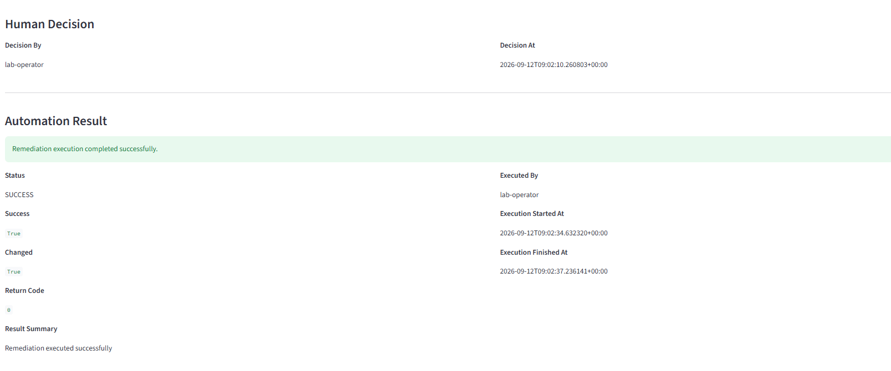
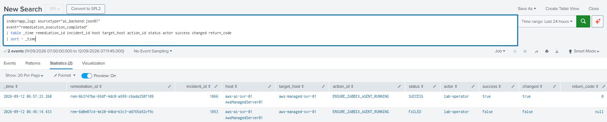

# Operator Console & Remediation Audit

## Remediation Audit Completion & Human-in-the-Loop Operator Console

This phase improves the operational usability and auditability of the
**AI-Assisted Hybrid Monitoring & Automation Lab** after the end-to-end failure and recovery validation.

The work focused on two areas:

-   Completing structured audit logging for remediation execution
-   Providing a secure operator interface for human approval and
    execution

## 1. Objectives

The main goals were to:

-   Record remediation execution results in Splunk
-   Preserve the human-in-the-loop remediation lifecycle
-   Provide a simple operator UI for approval, rejection, and execution
-   Keep the AI Backend private rather than exposing its API broadly
-   Make the Operator Console persistent through systemd

## 2. Remediation Execution Audit Logging

The AI Backend was updated to generate a structured event when
remediation execution completes.

``` text
event=remediation_execution_completed
```

The event records operational fields such as:

-   remediation ID
-   incident ID
-   host and target host
-   action ID
-   operator
-   final status
-   success / changed
-   return code

Both **SUCCESS** and **FAILED** execution events were validated in
Splunk.

This closes the observability gap between remediation approval and the
final automation result.

## 3. Human-in-the-Loop Operator Console

A lightweight **Streamlit Operator Console** was deployed on the
Monitoring Server.

The console allows an operator to:

-   View remediation proposals
-   Select a remediation directly from the table
-   Review AI recommendations
-   Review the deterministic executable action
-   Approve or reject pending remediation
-   Execute approved remediation
-   Review the final automation result

The interface clearly separates:

``` text
AI Recommendation
        ↓
Deterministic Executable Action
        ↓
Human Decision
        ↓
Automation Result
```

The AI remains advisory only and does not directly execute
infrastructure changes.

## 4. Remediation Lifecycle

The console follows the existing remediation lifecycle:

``` text
PENDING_APPROVAL
      ↓
APPROVED / REJECTED
      ↓
EXECUTING
      ↓
SUCCESS / FAILED
```

Human decision information is displayed using the active lifecycle
fields:

-   `decision_by`
-   `decision_at`

Execution information includes:

-   `executed_by`
-   `execution_started_at`
-   `execution_finished_at`
-   `success`
-   `changed`
-   `return_code`
-   `result_summary`

## 5. Secure Access Design

The Operator Console runs only on the Monitoring Server loopback
interface:

``` text
127.0.0.1:8501
```

It is accessed from the operator workstation through an SSH tunnel using
the Bastion Server.

``` text
Operator Workstation
        │
        │ SSH
        ▼
Bastion Server
        │
        │ SSH
        ▼
Monitoring Server
        │
        └── 127.0.0.1:8501
              Streamlit Operator Console
                    │
                    ▼
              AI Backend :8000
```

No additional public or Security Group access to TCP 8501 is required.

## 6. Service Persistence

The Operator Console was registered as a systemd service:

``` text
operator-console.service
```

The service:

-   Runs under the `ubuntu` user
-   Uses the dedicated Python virtual environment
-   Binds Streamlit to `127.0.0.1:8501`
-   Connects to the private AI Backend
-   Automatically starts after reboot
-   Restarts on failure

## 7. Validation

The completed workflow was validated through the Operator Console:

``` text
Remediation Proposal
        ↓
Human Approval
        ↓
Execute Remediation
        ↓
Automation API / Ansible
        ↓
SUCCESS
        ↓
Lifecycle Result + Splunk Audit
```

A successful remediation transitioned to `SUCCESS`, and the console
displayed the operator decision and automation execution details.

## 8. Validation Evidence

### Human-in-the-Loop Remediation Lifecycle

The Operator Console clearly separates AI recommendations, deterministic
executable actions, human decisions, and automation results.



### Remediation Execution Audit

Structured remediation completion events provide an auditable record of
both successful and failed automation executions in Splunk.



## 9. Outcome

This phase completed the operational layer of the remediation workflow
by combining:

-   AI-assisted incident recommendations
-   Deterministic remediation policy
-   Human approval
-   Controlled automation execution
-   Structured Splunk audit logging
-   Secure operator access

The result is an operationally validated human-in-the-loop remediation workflow
where AI provides guidance, operators retain control, and automation
actions remain auditable.
