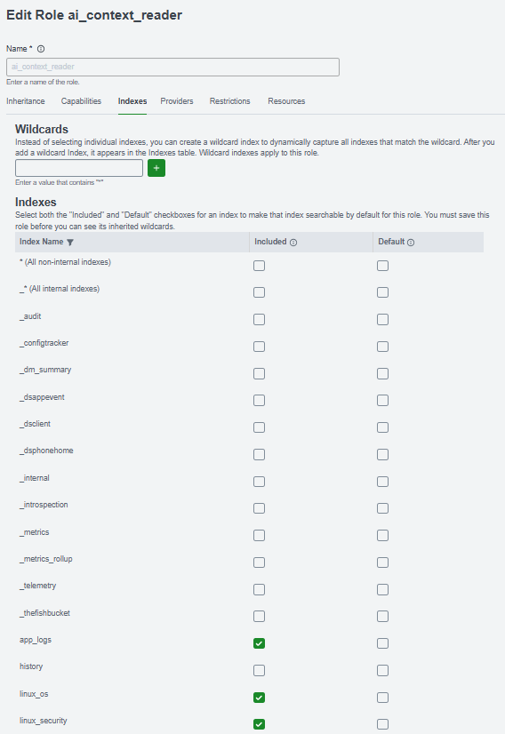
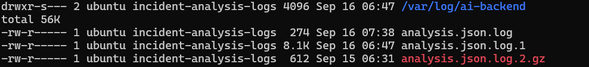
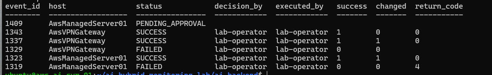
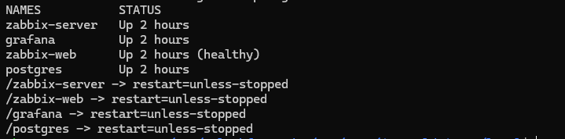

# Security & Reliability Review

## Overview

This phase reviews the completed **AI-Assisted Hybrid Monitoring & Automation Lab** for network exposure, least privilege, secrets and file permissions, remediation authorization, service persistence, auditability, and documented operational limitations.

The review did not redesign the working architecture. It validated existing controls, hardened identified weaknesses, and documented remaining lab trade-offs.

---

## 1. Review Scope

The review covered:

- AWS Security Groups and inter-service network paths;
- SSH and administrative access;
- AI Backend and Remediation API access;
- Splunk Server, Universal Forwarders, and API authorization;
- Ansible and Ansible Vault scope;
- WireGuard connectivity;
- structured application and remediation logs;
- SQLite permissions;
- Docker and systemd persistence;
- remediation lifecycle and audit history;
- Git and configuration hygiene.

---

## 2. Role-Based Security Group Design

The AWS environment uses separate Security Groups for different service responsibilities.

The AWS console currently shows ten named project Security Groups plus two AWS `default` groups. The default groups are not part of the intentional application security model and are omitted below.

| Security Group | Role | Primary Security Purpose |
|---|---|---|
| `bastion-sg` | Bastion | Administrative SSH entry boundary |
| `monitor-sg` | Monitoring Server | Monitoring platform and approved internal connectivity |
| `ai-backend-sg` | AI Backend | Private incident-analysis API boundary |
| `automation-sg` | Automation Server | Private remediation-service boundary |
| `managed-server-sg` | Managed workload | Base workload access boundary |
| `ansible-managed-sg` | Ansible-managed nodes | SSH management authorization |
| `zabbix-agent-sg` | Monitored nodes | Zabbix Agent monitoring authorization |
| `splunk-client-sg` | AWS Forwarder clients | Identifies AWS hosts authorized to forward logs |
| `splunk-server-sg` | Splunk Server | Splunk receiver/API/administrative service boundary |
| `wireguard-sg` | WireGuard Gateway | Hybrid VPN gateway boundary |

### Why Multiple Security Groups Are Used

The design separates server identity from service responsibility.

A host can participate in multiple operational roles:

```text
Managed EC2 instance
├── base workload access
├── Ansible management
├── Zabbix monitoring
└── Splunk forwarding
```

Instead of placing every rule in one large Security Group, reusable service-oriented groups can be attached as needed:

```text
managed-server-sg
ansible-managed-sg
zabbix-agent-sg
splunk-client-sg
```

This makes the purpose of a rule easier to understand and limits unrelated access when new servers are onboarded.

`splunk-client-sg` should be interpreted as an authorization/grouping mechanism for AWS instances running Splunk Universal Forwarder, not as the Splunk client software itself.

---

## 3. Validated Network Flows

The Security Group review traced required communication by initiator, destination, and purpose.

| Initiator / Source | Destination | Port / Protocol | Purpose | Review Result |
|---|---|---|---|---|
| Administrator | Bastion | TCP 22 | Administrative SSH | Required |
| Automation Server | Ansible-managed nodes | TCP 22 | Configuration and remediation | Required |
| Zabbix Server | Zabbix Agent hosts | TCP 10050 | Passive checks | Required |
| Zabbix Agent hosts | Zabbix Server | TCP 10051 | Active-check path | Retained for testing/future use |
| AWS Splunk Forwarder clients | Splunk Server | TCP 9997 | Log forwarding | Required |
| AI Backend | Splunk Server | TCP 8089 | Splunk search/context API | Required |
| Monitoring Server | AI Backend | TCP 8000 | Incident webhook and Operator Console backend access | Required |
| AI Backend | Automation Server | TCP 8443 | Controlled remediation API | Required |
| Local peer | WireGuard Gateway | UDP 51820 | WireGuard VPN | Required |
| Zabbix Server | WireGuard Gateway | TCP 10050 | Gateway monitoring | Required where passive monitoring is used |

No reviewed ingress path required immediate removal. Splunk ports `8000`, `8089`, and `9997` may listen on host interfaces, but AWS Security Groups restrict permitted network sources and remain the primary network boundary.

---

## 4. Least-Privilege and Data Protection Improvements

### Splunk API Authorization

The dedicated `ai-context-api` account was reassigned from the broader built-in Splunk `user` role to:

```text
ai_context_reader
├── app_logs
├── linux_os
└── linux_security
```

A live incident-analysis test continued to retrieve Splunk evidence after the change.

**Status: FIXED / VALIDATED**

### AI Analysis and Remediation Logs

The AI analysis log is stored at:

```text
/var/log/ai-backend/analysis.json.log
```

The hardened model uses:

```text
Directory: 2750
Log file:  0640
Group:     incident-analysis-logs
systemd:   SupplementaryGroups=incident-analysis-logs
           UMask=0027
```

Daily rotation, 14 retained rotations, compression, delayed compression, and `copytruncate` were configured and validated. The Remediation API execution log follows the same general least-privilege approach.

**Status: FIXED / VALIDATED**

### SQLite Permissions

The AI Backend SQLite database was found with unnecessary local read access and was restricted to:

```text
0600 ubuntu:ubuntu
```

**Status: FIXED / VALIDATED**

### Scoped Ansible Vault

The Splunk administrator credential originally lived in automatically loaded inventory group variables. Because a host can belong to both Zabbix and Splunk groups, unrelated Ansible operations attempted to load the Splunk Vault.

The secret was moved to:

```text
automation/vault/splunk.yml
```

Only the Splunk Forwarder playbook explicitly loads this Vault.

```text
General Ansible / Zabbix remediation → no Splunk Vault dependency
Splunk Forwarder workflow            → explicitly loads vault/splunk.yml
```

**Status: FIXED / VALIDATED**

### Repository Hygiene

Repository ignore rules protect local backup files and other sensitive runtime material. Existing exclusions were reviewed for SSH keys, environment files, Vault password files, Terraform state, local Ansible inventory, and logs.

**Status: FIXED / VALIDATED**

---

## 5. Remediation Security Controls

The remediation design ensures that AI-generated text cannot become arbitrary infrastructure execution.

```text
AI recommendation
        ↓
Deterministic policy
        ↓
PENDING_APPROVAL
        ↓
Human approval / rejection
        ↓
APPROVED
        ↓
Private Remediation API
        ↓
Allowlisted Ansible execution
        ↓
SUCCESS / FAILED
```

The backend and database enforce lifecycle transitions rather than relying only on the Operator Console.

The private Remediation API applies:

- service-token authentication;
- action allowlisting;
- target-host allowlisting;
- fixed action-to-playbook mapping;
- no caller-supplied arbitrary shell command or playbook;
- subprocess execution without `shell=True`;
- execution timeout;
- return-code and failure handling;
- fail-closed behavior when the service token is unavailable.

**Status: VALIDATED / PASS**

---

## 6. Reliability Validation

The following services were validated as systemd-managed and configured for persistence:

```text
AI Backend
Remediation API
Splunk Server
Splunk Universal Forwarder
WireGuard wg-quick@wg0
```

The Monitoring Server uses Docker for:

```text
Zabbix Server
Zabbix Web
Grafana
PostgreSQL
```

The monitoring containers were running during validation and use `restart=unless-stopped`.

**Status: VALIDATED / PASS**

---

## 7. Auditability and Traceability

The remediation data model retains:

- incident/event association;
- source and target host;
- action ID;
- remediation lifecycle state;
- operator identity and decision timestamp;
- execution actor;
- execution start and finish timestamps;
- success/failure result;
- changed state;
- Ansible return code.

Both successful and failed remediation executions were observed. Structured application/remediation logs are also forwarded to Splunk, providing a second operational audit surface.

**Status: VALIDATED / PASS**

---

## 8. Findings and Risk Decisions

| Finding | Decision | Status |
|---|---|---|
| Splunk API account had broader index access than required | Restricted to `ai_context_reader` and three approved indexes | **FIXED / VALIDATED** |
| Structured logs required stronger permissions and retention | Dedicated group, restrictive modes, systemd umask, log rotation | **FIXED / VALIDATED** |
| SQLite database was locally readable with mode `0644` | Restricted to `0600` | **FIXED / VALIDATED** |
| Splunk Vault created cross-workflow dependency | Moved to workflow-scoped `automation/vault/splunk.yml` | **FIXED / VALIDATED** |
| AI Backend disables Splunk TLS certificate verification | Private SG-restricted path and least-privileged account retained; trusted PKI deferred | **ACCEPTED / DOCUMENTED** |
| RedHat UF install lacks independent package verification | Pinned official build retained; checksum/signature verification deferred | **ACCEPTED / DOCUMENTED** |
| Existing RedHat host predates current UF fresh-install role | Validate later on a disposable/new RedHat-family host | **PARTIALLY VALIDATED** |
| Core service startup/restart persistence | Existing systemd and Docker controls retained | **VALIDATED / PASS** |

---

## 9. Accepted Limitations

### Splunk TLS Certificate Verification

The AI Backend currently connects to the Splunk Management API with certificate verification disabled.

Compensating controls are:

```text
private VPC communication
+ Security Group restricted TCP 8089
+ dedicated non-admin API identity
+ ai_context_reader index restriction
```

Future hardening should deploy a trusted internal certificate/CA and enable certificate verification.

### RedHat Splunk Forwarder Package Integrity

The RedHat-family installation uses an official Splunk HTTPS download URL with a pinned version/build but currently uses:

```text
disable_gpg_check: true
```

It does not independently validate a vendor checksum. Future hardening should verify the package using a trusted checksum or signature.

### RedHat Fresh-Install Validation

`aws-managed-svr-01` currently runs Splunk Universal Forwarder 10.4.1 and predates the latest Ansible fresh-install workflow. The role correctly preserves the existing installation rather than implicitly upgrading it.

A future disposable RedHat-family host should validate the complete fresh-install path.

### Public IPv4 Trade-Off

Bastion and WireGuard intentionally retain public connectivity.

Some early lab workloads also retain public IPv4 addresses from the initial no-NAT design. They were not recreated solely to remove those addresses because application ingress is restricted by Security Groups.

This remains a documented cost/security trade-off for the lab.

---

## 10. Evidence

### Splunk Least-Privilege Role



### Splunk Context Retrieval


### AI Analysis Log Security



### Remediation Audit Trail



### Monitoring Reliability



---

## 11. Outcome

The final review strengthened the lab without changing its core architecture.

The most important security characteristic is the use of **multiple independent control layers**:

```text
Role-based network boundaries
        ↓
Least-privilege service identities
        ↓
Deterministic remediation policy
        ↓
Human authorization
        ↓
Action + target allowlists
        ↓
Audited automation
        ↓
Independent monitoring verification
```

Remaining TLS, package-integrity, and lab-network trade-offs are documented explicitly rather than represented as fully resolved.
